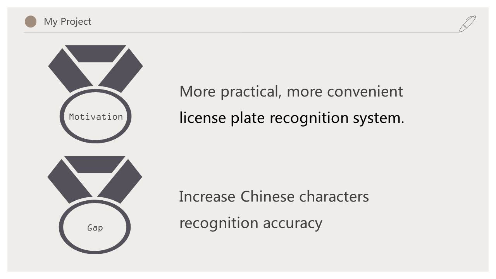
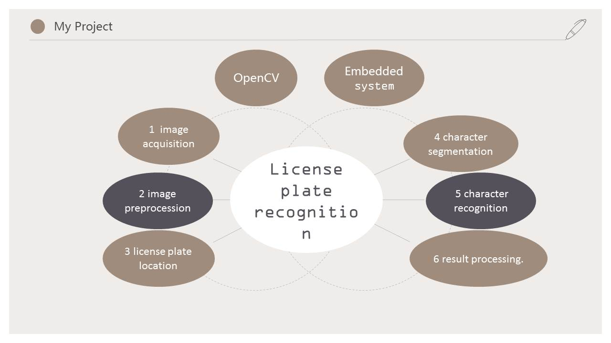
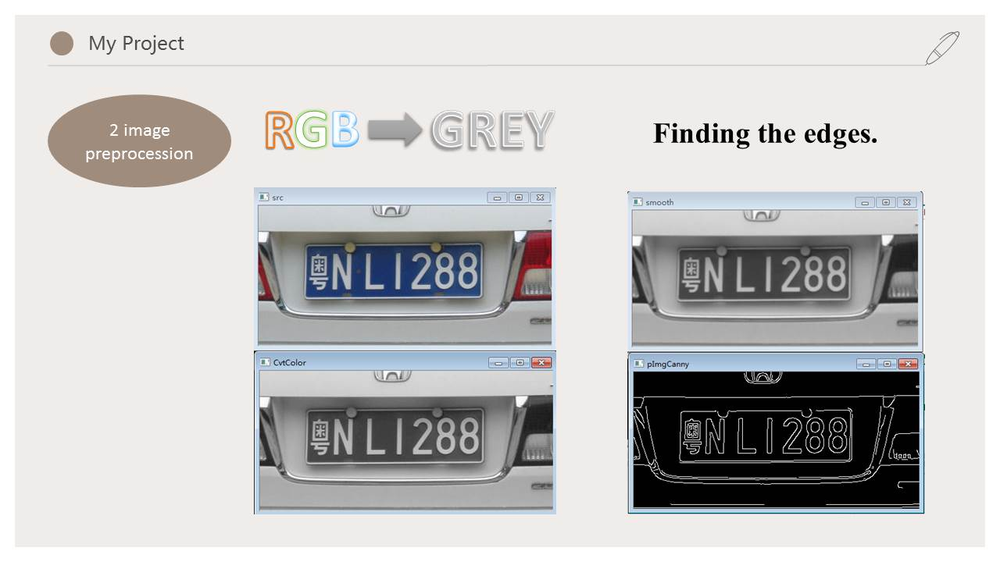
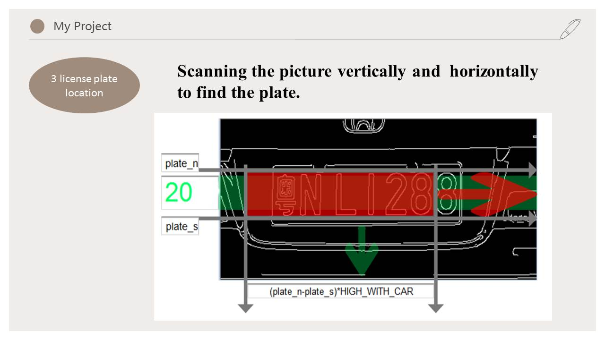
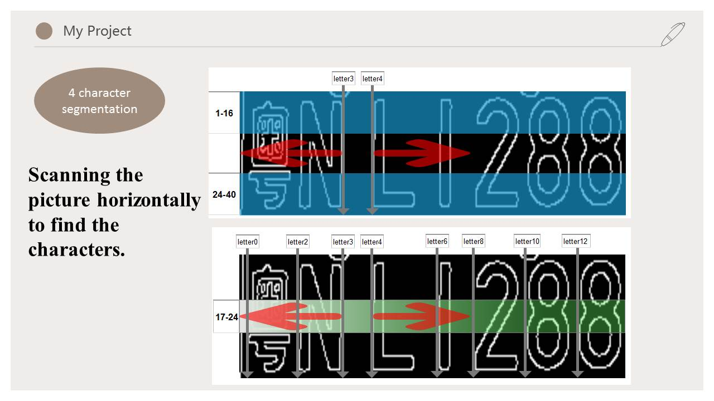
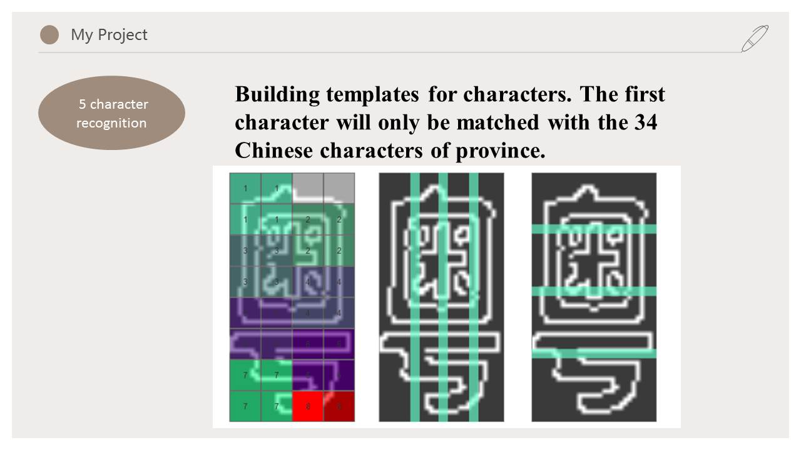
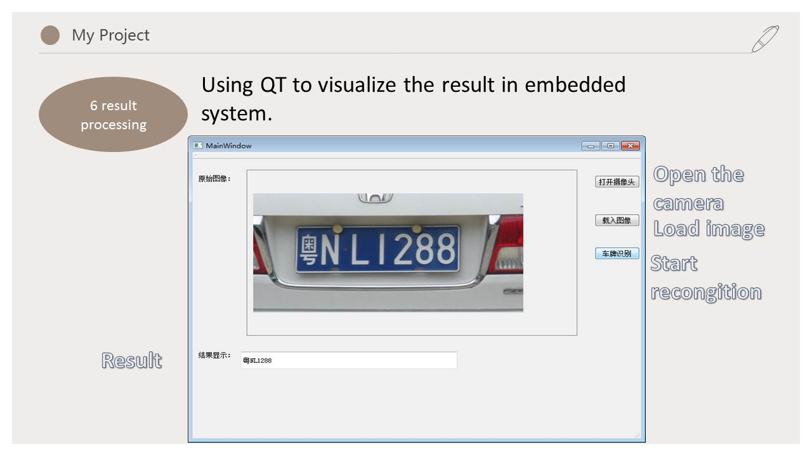
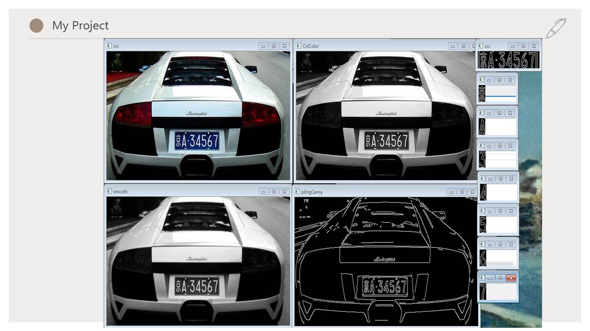

# The design and implementation of a license plate recognition technique in embedded systems
This is my undergraduate graduation project.

# Abstract
The research task of this project is the design and implementation of a license plate recognition technique on ARM embedded systems. By transplanting the license plate recognition algorithm into an embedded platform, this project implements the functionalities of vehicle image acquisition, license plate image recognition and storage functions. This thesis first introduces the background knowledge of intelligent traffic, as well as existing license plate recognition methods and products. The paper further introduces the preliminary knowledge of license plate recognition. Furthermore, this thesis presents in details the basic functional blocks of the license plate recognition algorithm, including image acquisition, image preprocessing, license plate location, character segmentation, character recognition and result processing. From the perspective of system design, this work has built an embedded Linux system by kernel trimming and program transplantation, as well as implementing the algorithm based on the OpenCV image processing function library and Qt/Embedded development environment. Verification results indicate that the designed system achieves a high recognition accuracy for Chinese single line car license plates. The research on the effective recognition of double line license plates will be conducted in further research tasks.

# Keywords 
Embedded system License location Character segmentation Character
recognition OpenCV

# System Overview

